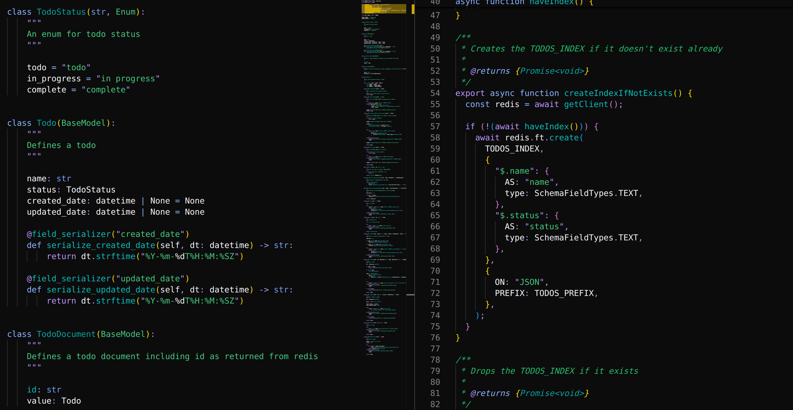

# wwj.vscode-theme README

This is my personal VS Code theme, loosely modeled after [CarbonFox](https://github.com/EdenEast/nightfox.nvim)

## Usage

This isn't published as a VS Code extension, so to use it you will need to clone the repository and install it yourself.

### Requirements

1. [VS Code](https://code.visualstudio.com/)
2. [bun](https://bun.sh/)

### Contributions

PRs are welcomed.
